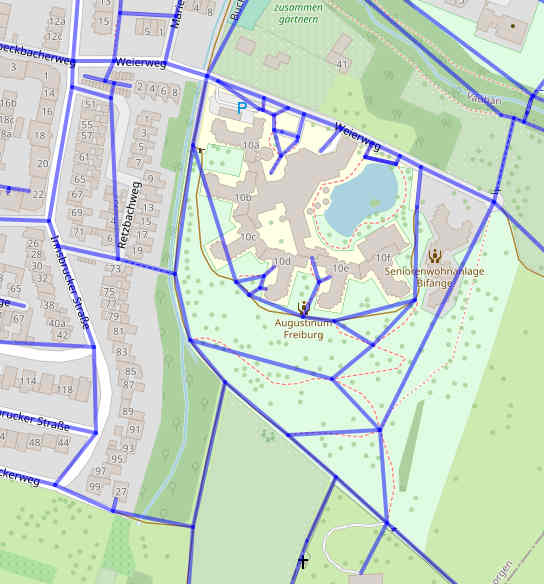

# 3. Options

There are several options for creating additional data in the database.

## Option "rtree"

This option creates additional [R*Tree](https://www.sqlite.org/rtree.html)
indexes **rtree_node** and **rtree_way** for finding ways quickly.  

Internally, the index **rtree_way** is created as follows:  
``` sql
CREATE VIRTUAL TABLE rtree_way USING rtree(way_id, min_lat, max_lat, min_lon, max_lon);

INSERT INTO rtree_way (way_id, min_lat, max_lat, min_lon, max_lon)
SELECT way_nodes.way_id,min(nodes.lat),max(nodes.lat),min(nodes.lon),max(nodes.lon)
FROM way_nodes
LEFT JOIN nodes ON way_nodes.node_id=nodes.node_id
GROUP BY way_nodes.way_id;

/*
** Find all elements of the index (ways) that are contained within the boundingbox:
**    min_lon (x1):  7.851, min_lat (y1): 47.995
**    max_lon (x2):  7.854, max_lat (y2): 47.996
*/
SELECT way_id
FROM rtree_way
WHERE min_lon>= 7.851 AND max_lon<= 7.854
 AND  min_lat>=47.995 AND max_lat<=47.996;
/*
** Find all elements of the index (ways) that overlap the boundingbox:
*/
SELECT way_id
FROM rtree_way
WHERE max_lon>= 7.851 AND min_lon<= 7.854
 AND  max_lat>=47.995 AND min_lat<=47.996;
/*
** Limits of an element of the index:
*/
SELECT min_lon,max_lon,min_lat,max_lat
FROM rtree_way
WHERE way_id=4872512;
```


## Option "addr"

This option creates tables **addr_street** and **addr_housenumber** with addresses.  

```
column       | type                | description
-------------|---------------------|-------------------------------------

Table "addr_street":
street_id    | INTEGER PRIMARY KEY | street ID
postcode     | TEXT                | postcode
city         | TEXT                | city
street       | TEXT                | street
min_lon      | REAL                | boundingbox min. longitude
min_lat      | REAL                | boundingbox min. latitude
max_lon      | REAL                | boundingbox max. longitude
max_lat      | REAL                | boundingbox max. latitude
- INDEX addr_street_1 ON addr_street (postcode,city,street)

Table "addr_housenumber":
housenumber_id | INTEGER PRIMARY KEY | housenumber ID
street_id      | INTEGER             | street ID
housenumber    | TEXT                | housenumber
lon            | REAL                | longitude
lat            | REAL                | latitude
way_id         | INTEGER             | way ID
node_id        | INTEGER             | node ID
- INDEX addr_housenumber_1 ON addr_housenumber (street_id)
```

The view **addr_view** join the two tables.  


## Option "graph"

This option creates an additional table **graph** with the complete graph
of all highways. This data is required for routing purposes.  

```
Table "graph":
column          | type                | description
----------------|---------------------|-------------------------------------
edge_id         | INTEGER PRIMARY KEY | edge ID
start_node_id   | INTEGER             | edge start node ID
end_node_id     | INTEGER             | edge end node ID
dist            | INTEGER             | distance in meters
way_id          | INTEGER             | way ID
permit          | INTEGER             | bit field access
```

Visualization of the table 'graph':  


The bit field **permit** determines who may use this edge:  
Bit 0 : 2^0  1  foot  
Bit 1 : 2^1  2  bike_gravel  
Bit 2 : 2^2  4  bike_road  
Bit 3 : 2^3  8  car  
Bit 4 : 2^4 16  bike_oneway  
Bit 5 : 2^5 32  car_oneway  

This field is currently not yet filled, but there is a script that
fills this field, see **./src_py/fill_graph_permit.py**.

Queries on how to determine a smaller subgraph from this table
can be found in **./queries/graph_subgraph.sql**.


## Option "noindex"

This option suppresses the creation of the indexes (not recommended).

