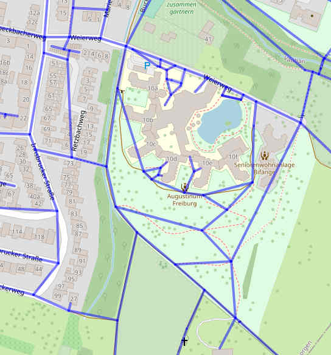

# 1. osm2sqlite

A simple command line tool for reading
[OpenStreetMap XML data](https://wiki.openstreetmap.org/wiki/OSM_XML)
into a SQLite database.

Read simple XML file **test.osm** into database **test.db**:  
`osm2sqlite test.db test.osm`  

OSM data can be obtained from a provider such as [Geofabrik](https://download.geofabrik.de).

## Read .osm.bz2 file

The OSM XML data is provided as bzip2 compressed data.

To avoid unpacking the bzip2 file, the tool can read from stdin.

Examples for reading .osm.bz2 files:  
`7z e -so ../germany.osm.bz2 | osm2sqlite germany.db -`  
`bzip2 -c -d ../germany.osm.bz2 | osm2sqlite germany.db -`  

> The .osm.bz2 format is [deprecated](https://download.geofabrik.de/bz2.html).  
> In future, only .osm.pbf files will be provided from Geofabrik.

## Read .osm.pbf file

The tool **osmium** can convert .osm.pbf files to .osm.

Example for reading an .osm.pbf file:  
`osmium cat freiburg.osm.pbf -f osm -o - | osm2sqlite freiburg.db -`

## Install osmium

Install osmium on Fedora Linux:  
`sudo dnf install osmium-tool.x86_64`  

Convert .osm.pbf to osm, output to stdout:   
`osmium cat myfile.osm.pbf --output-format=osm --output=- | less -S`  
`osmium cat myfile.osm.pbf -f osm -o - | less -S`  

Convert myfile.osm.pbf to myfile.osm.bz2:  
`osmium cat myfile.osm.pbf -o myfile.osm.bz2`

<https://osmcode.org/osmium-tool/>


# 2. Tables

The following tables and indexes are created in the database:

#### Table "nodes"
column       | type                | description
-------------|---------------------|-------------------------------------
node_id      | INTEGER PRIMARY KEY | node ID
lon          | REAL                | longitude
lat          | REAL                | latitude

#### Table "node_tags"
column       | type                | description
-------------|---------------------|-------------------------------------
node_id      | INTEGER             | node ID
key          | TEXT                | tag key
value        | TEXT                | tag value
- INDEX node_tags__node_id ON node_tags (node_id)
- INDEX node_tags__key     ON node_tags (key)

#### Table "way_nodes"
column       | type                | description
-------------|---------------------|-------------------------------------
way_id       | INTEGER             | way ID
node_id      | INTEGER             | node ID
node_order   | INTEGER             | node order
- INDEX way_nodes__way_id  ON way_nodes (way_id, node_order)
- INDEX way_nodes__node_id ON way_nodes (node_id)

#### Table "way_tags"
column       | type                | description
-------------|---------------------|-------------------------------------
way_id       | INTEGER             | way ID
key          | TEXT                | tag key
value        | TEXT                | tag value
- INDEX way_tags__way_id   ON way_tags (way_id)
- INDEX way_tags__key      ON way_tags (key)

#### Table "relation_members"
column       | type                | description
-------------|---------------------|-------------------------------------
relation_id  | INTEGER             | relation ID
ref          | TEXT                | reference ('node','way','relation')
ref_id       | INTEGER             | node, way or relation ID
role         | TEXT                | describes a particular feature
member_order | INTEGER             | member order
- INDEX relation_members__relation_id ON relation_members (relation_id, member_order)
- INDEX relation_members__ref_id      ON relation_members (ref_id)

#### Table "relation_tags"
column       | type                | description
-------------|---------------------|-------------------------------------
relation_id  | INTEGER             | relation ID
key          | TEXT                | tag key
value        | TEXT                | tag value
- INDEX relation_tags__relation_id    ON relation_tags (relation_id)
- INDEX relation_tags__key            ON relation_tags (key)

The database can be easily queried with the [SQLite CLI tool](https://www.sqlite.org/cli.html).


# 3. Options

There are several options for creating additional data in the database.

## Option "rtree"

This option creates additional [R*Tree](https://www.sqlite.org/rtree.html)
indexes **rtree_node** and **rtree_way** for finding ways quickly.  

Internally, the index **rtree_way** is created as follows:  
``` sql
CREATE VIRTUAL TABLE rtree_way USING rtree(way_id, min_lat, max_lat, min_lon, max_lon);

INSERT INTO rtree_way (way_id, min_lat, max_lat, min_lon, max_lon)
SELECT way_nodes.way_id,min(nodes.lat),max(nodes.lat),min(nodes.lon),max(nodes.lon)
FROM way_nodes
LEFT JOIN nodes ON way_nodes.node_id=nodes.node_id
GROUP BY way_nodes.way_id;
```

### Example queries

``` sql
/*
** Find all elements of the index (ways) that are contained within the boundingbox:
**    min_lon (x1):  7.851, min_lat (y1): 47.995
**    max_lon (x2):  7.854, max_lat (y2): 47.996
*/
SELECT way_id
FROM rtree_way
WHERE min_lon>= 7.851 AND max_lon<= 7.854
 AND  min_lat>=47.995 AND max_lat<=47.996;
/*
** Find all elements of the index (ways) that overlap the boundingbox:
*/
SELECT way_id
FROM rtree_way
WHERE max_lon>= 7.851 AND min_lon<= 7.854
 AND  max_lat>=47.995 AND min_lat<=47.996;
/*
** Limits of an element of the index:
*/
SELECT min_lon,max_lon,min_lat,max_lat
FROM rtree_way
WHERE way_id=4872512;
```


## Option "addr"

This option creates two tables with address data.  

#### Table "addr_street"
column       | type                | description
-------------|---------------------|-------------------------------------
street_id    | INTEGER PRIMARY KEY | street ID
postcode     | TEXT                | postcode
city         | TEXT                | city
street       | TEXT                | street
min_lon      | REAL                | boundingbox min. longitude
min_lat      | REAL                | boundingbox min. latitude
max_lon      | REAL                | boundingbox max. longitude
max_lat      | REAL                | boundingbox max. latitude
- INDEX addr_street_1 ON addr_street (postcode,city,street)

#### Table "addr_housenumber"
column       | type                | description
-------------|---------------------|-------------------------------------
housenumber_id | INTEGER PRIMARY KEY | housenumber ID
street_id      | INTEGER             | street ID
housenumber    | TEXT                | housenumber
lon            | REAL                | longitude
lat            | REAL                | latitude
way_id         | INTEGER             | way ID
node_id        | INTEGER             | node ID
- INDEX addr_housenumber_1 ON addr_housenumber (street_id)

The view **addr_view** join the two tables.


## Option "graph"

This option creates an additional table **graph** with the complete graph
of all highways.  
This data is required for routing purposes, for example.  

#### Table "graph"
column          | type                | description
----------------|---------------------|-------------------------------------
edge_id         | INTEGER PRIMARY KEY | edge ID
start_node_id   | INTEGER             | edge start node ID
end_node_id     | INTEGER             | edge end node ID
dist            | INTEGER             | distance in meters
way_id          | INTEGER             | way ID
permit          | INTEGER             | bit field access

Visualization of the table 'graph':  


The bit field **permit** determines who may use this edge:  
Bit 0 : 2^0  1  foot  
Bit 1 : 2^1  2  bike_gravel  
Bit 2 : 2^2  4  bike_road  
Bit 3 : 2^3  8  car  
Bit 4 : 2^4 16  bike_oneway  
Bit 5 : 2^5 32  car_oneway  

> This field is currently not yet filled, but there is a script that
> fills this field, see **./src_py/fill_graph_permit.py**.

Queries on how to determine a smaller subgraph from this table
can be found in **./queries/graph_subgraph.sql**.


## Option "noindex"

This option suppresses the creation of the indexes (not recommended).


# 4. Map Drawing

For map drawing R\*Tree indexes (see option **rtree**) and table **map_def** with
map definitions (colors etc.) are required in the database.  
(see **./src_py/map_def.sql**)  

Creation of the **map_def** table:  
`sqlite3 ../freiburg.db < map_def.sql`  

## map.py

Example to generate a map with zoomlevel 16 and size 900 x 600px:  
`./map.py ../freiburg.db 7.800 47.979 16 900 600 map_zoom16.svg`  

Converting SVG to PNG with "inkscape":  
`inkscape map_zoom16.svg -o map_zoom16.png`

## Map projection

In OSM, the coordinates are in [WGS84](https://en.wikipedia.org/wiki/World_Geodetic_System#WGS_84)
format to describe points on a spherical surface.  
This format is also described under the name [EPSG:4326](https://epsg.io/4326).  

In order to draw a map, the coordinates of a spherical surface must
be mapped onto a plane surface.  
The [Mercator projection](https://en.wikipedia.org/wiki/Mercator_projection) is usually used for this.  
(see **./src_py/proj.py**)  

In principle, the Mercator projection cannot be used to display
coordinates near the poles.  

Most often the simplified [Web Mercator projection](https://en.wikipedia.org/wiki/Web_Mercator_projection) is used.        
This format is also described under the name [EPSG:3857](https://epsg.io/3857).  
Polar areas with abs(latitude) bigger then 85.05112878 (85°3'4.0636") are clipped off.

Comparison of WGS84 (lon, lat) with Web Mercator (x, y):  
```
                                 ^
               lat:  85.05112878 | y:  20037508.343
                                 |
x: -20037508.343                 |                 x: 20037508.343
---------------------------------0--------------------------------->
lon: -180°                       |                 lon: +180°
                                 |
               lat: -85.05112878 | y: -20037508.343
```

As you can see, the WGS84 coordinates are transformed into a square world map.

The conversion of Web Mercator coordinates into pixel coordinates is relatively simple.

## Zoomlevel

Defined pixel sizes (zoomlevel) of a square world map:  
```
zoomlevel   size_world_map_in_pixel     meter_per_pixel
    0              256 x 256               156543.03      
    1              512 x 512                78271.52      
    2             1024 x 1024               39135.76      
    3             2048 x 2048               19567.88      
    4             4096 x 4096               9783.94       
    5             8192 x 8192               4891.97       
    6            16384 x 16384              2445.98       
    7            32768 x 32768              1222.99       
    8            65536 x 65536               611.50       
    9           131072 x 131072              305.75       
   10           262144 x 262144              152.87       
   11           524288 x 524288              76.44        
   12          1048576 x 1048576             38.22        
   13          2097152 x 2097152             19.11        
   14          4194304 x 4194304              9.55        
   15          8388608 x 8388608              4.78        
   16         16777216 x 16777216             2.39        
   17         33554432 x 33554432             1.19        
   18         67108864 x 67108864             0.60        
   19        134217728 x 134217728            0.30        
```

## Drawing the map

The map will be drawn in layers. Layer 1 is drawn first:

Layer 1: grassland, farmland  
Layer 2: forest, orchard, wineyard, parks   
Layer 3: sports field, playground  
Layer 4: water  
Layer 5: building, Swimming-Pools  
Layer 6: For two-colour roads lower part  
Layer 7: For two-colour roads upper part  
Layer 8: Superordinate roads (Bundesstr. Autobahn)  
Layer 9: Bridges, Trees, POI  
Layer 10: Powerline  
Layer 99: Unknown Ways (red)  


# 5. Routing

Table **graph** (see option **graph**) and R\*Tree **rtree_way** (see option **rtree**)  
are required for the calculation of shortest paths.

## route.py

```
Calculates shortest route.

Usage:
./src_py/route.py DATABASE LON_START LAT_START LON_DEST LAT_DEST PERMIT CSVFILE

PERMIT: 1 (foot), 2 (bike_gravel), 4 (bike_road) or 8 (car)
```

As an example, the  
`./route.py freiburg.db 7.853 47.995 7.862 47.995 1 route.csv`  
command calculates the shortest route for pedestrians and saves a list of
the route coordinates in the *route.csv* file.

Command  
`./tools/map_csv.py route.csv route.html`  
creates an HTML file with an interactive map of the route.  
  

Command  
`./tools/convert_csv2gpx.py route.csv route.gpx`  
converts the coordinate list in the CSV file into a GPX file.


# 6. Tools

## Convert CSV to GPX

See scripts `convert_csv2gpx.py` and `convert_gpx2csv.py`.

## Show data on a map with Leaflet

Simple library "html_leaflet.py" for creating HTML files with
[Leaflet.js 1.5.1](https://web.archive.org/web/20201202155513/https://leafletjs.com/reference-1.5.1.html).  

The script `html_leaflet_demo.py` shows the usage.

## Check OSM data

The script `./tools/check_addr_street_name.py` checks if the addr:street name is
identical with the street name.
# Appendix


## Test

For testing, the databases of the C and Python version are compared.

    ./test/run_test.sh

It has been found that the mantissa rarely differs by 1 bit.  
However, this should not be a problem for calculations.  

```
+-------------+-------+-----------------------------+---------------------+
|   node_id   |  db   |    format('%!.50f',lon)     |    binary64_lon     |
+-------------+-------+-----------------------------+---------------------+
| 25724717    | db_c  | 8.8370532999999991119466358 | x'4021ac924009048b' |
| 25724717    | db_py | 8.8370533000000008883034752 | x'4021ac924009048c' |
| 25885946    | db_c  | 8.8214282999999991119466358 | x'4021a4924009048b' |
| 25885946    | db_py | 8.8214283000000008883034752 | x'4021a4924009048c' |
| 26652345    | db_c  | 8.8780443000000008879624147 | x'4021c18f05c1e0e1' |
| 26652345    | db_py | 8.8780442999999991116055753 | x'4021c18f05c1e0e0' |
| 31117904    | db_c  | 8.8619116000000008881443136 | x'4021b94c7a2c1609' |
| 31117904    | db_py | 8.8619115999999991117874742 | x'4021b94c7a2c1608' |
+-------------+-------+-----------------------------+---------------------+

+-------------+-------+-----------------------------+---------------------+
|   node_id   |  db   |    format('%!.50f',lat)     |    binary64_lat     |
+-------------+-------+-----------------------------+---------------------+
| 21316798    | db_c  | 53.076708000000003551122063 | x'404a89d19157abb9' |
| 21316798    | db_py | 53.076707999999996447429428 | x'404a89d19157abb8' |
| 21523098    | db_c  | 53.105010299999996447282979 | x'404a8d70fa3e1f1f' |
| 21523098    | db_py | 53.105010300000003555312422 | x'404a8d70fa3e1f20' |
| 25869795    | db_c  | 53.16163010000000355148586  | x'404a94b04b8cc64d' |
| 25869795    | db_py | 53.161630099999996447793226 | x'404a94b04b8cc64c' |
| 25869846    | db_c  | 53.025771400000003552577254 | x'404a834c7a2c1609' |
| 25869846    | db_py | 53.02577139999999644888462  | x'404a834c7a2c1608' |
+-------------+-------+-----------------------------+---------------------+
```


## Table size

Output from `sqlite3_analyzer freiburg-regbez-latest.db`:

```
/** Disk-Space Utilization Report For freiburg-regbez-latest.db

Page size in bytes................................ 65536     
...

*** Page counts for all tables and indices separately *************************

WAY_NODES......................................... 6024        17.7% 
NODES............................................. 5798        17.1% 
WAY_NODES__WAY_ID................................. 4400        12.9% 
WAY_NODES__NODE_ID................................ 4243        12.5% 
WAY_TAGS.......................................... 3367         9.9% 
WAY_TAGS__KEY..................................... 1926         5.7% 
WAY_TAGS__WAY_ID.................................. 1363         4.0% 
RTREE_WAY_NODE.................................... 1171         3.4% 
NODE_TAGS......................................... 1135         3.3% 
NODE_TAGS__KEY.................................... 622          1.8% 
RELATION_MEMBERS.................................. 487          1.4% 
NODE_TAGS__NODE_ID................................ 483          1.4% 
RTREE_WAY_ROWID................................... 475          1.4% 
RTREE_NODE_NODE................................... 402          1.2% 
GRAPH............................................. 379          1.1% 
ADDR_HOUSENUMBER.................................. 357          1.1% 
RELATION_MEMBERS__RELATION_ID..................... 283          0.83% 
RELATION_MEMBERS__REF_ID.......................... 246          0.72% 
GRAPH__WAY_ID..................................... 182          0.54% 
RTREE_NODE_ROWID.................................. 161          0.47% 
RELATION_TAGS..................................... 157          0.46% 
ADDR_HOUSENUMBER__STREET_ID....................... 102          0.30% 
RELATION_TAGS__KEY................................ 73           0.21% 
RELATION_TAGS__RELATION_ID........................ 53           0.16% 
ADDR_STREET....................................... 50           0.15% 
ADDR_STREET__POSTCODE_CITY_STREET................. 27           0.079% 
RTREE_WAY_PARENT.................................. 13           0.038% 
RTREE_NODE_PARENT................................. 5            0.015% 
MAP_DEF........................................... 1            0.003% 
MAP_DEF__KEY_VALUE................................ 1            0.003% 
SQLITE_SCHEMA..................................... 1            0.003% 

```

## GPX XML structure

```
0: gpx [creator, version, {http://www.w3.org/2001/XMLSchema-instance}schemaLocation]
    1: metadata [-]
        2: link [href]
            3: text [-]
        2: time [-]
        2: bounds [maxlat, maxlon, minlat, minlon]
    1: wpt [lat, lon]
        2: ele [-]
        2: name [-]
        2: cmt [-]
        2: desc [-]
        2: sym [-]
        2: extensions [-]
            3: gpxx:WaypointExtension [-]
                4: gpxx:DisplayMode [-]
        2: time [-]
    1: trk [-]
        2: name [-]
        2: extensions [-]
            3: gpxx:TrackExtension [-]
                4: gpxx:DisplayColor [-]
        2: trkseg [-]
            3: trkpt [lat, lon]
                4: ele [-]
                4: time [-]
```

## Links

<https://de.wikipedia.org/wiki/GPS_Exchange_Format>  
<https://www.gpsbabel.org/htmldoc-development/The_Formats.html>  
<https://www.gpsbabel.org/htmldoc-development/fmt_gpx.html>  
<https://www.topografix.com/gpx.asp>  
<https://www.j-berkemeier.de/ShowGPX.html>  

Problem Namespaces...

<https://gis.stackexchange.com/questions/228966/how-to-properly-get-coordinates-from-gpx-file-in-python>  
<https://stackoverflow.com/questions/14853243/parsing-xml-with-namespace-in-python-via-elementtree>  
<https://docs.python.org/3/library/xml.etree.elementtree.html#parsing-xml-with-namespaces>  
<https://mygeodata.cloud/converter/>  

