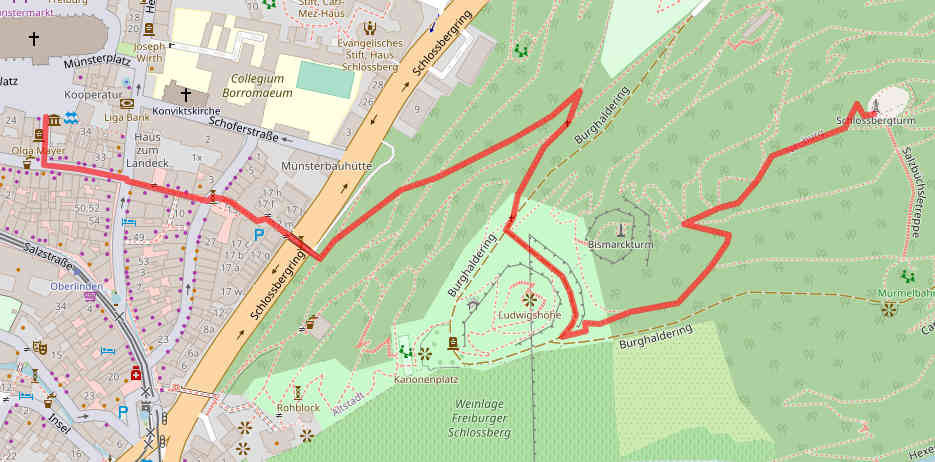

The directory **/misc** contains first experiments with the created database.

The bash script `0_make_database.sh` invokes the scripts to show the function.


# 1. Routing

First, routable data must be created from the OSM data in the database.

The script `create_table_graph.py` creates a table 'graph' in the database.  
This table contains the complete graph of all streets and roads.  

### Table 'graph'

column          | type                | description
----------------|---------------------|-------------------------------------
edge_id         | INTEGER PRIMARY KEY | edge ID
start\_node\_id | INTEGER             | edge start node ID
end\_node\_id   | INTEGER             | edge end node ID
dist            | INTEGER             | distance in meters
way_id          | INTEGER             | way ID

Visualization of the table 'graph':  


#### Queries to create a subgraph

``` sql
/*
** 1. Create temp. table with edges of the subgraph
**    - R*Tree 'rtree_way' is required, overlaps boundingbox slightly
**
** Boundingbox:
** min_lon (x1):  7.81
** min_lat (y1): 47.97
** max_lon (x2):  7.83
** max_lat (y2): 47.98
*/
CREATE TEMP TABLE subgraph AS
SELECT edge_id,start_node_id,end_node_id,dist,way_id
FROM graph
WHERE way_id IN (
 SELECT way_id
 FROM rtree_way
 WHERE max_lon>= 7.81 AND min_lon<= 7.83
  AND  max_lat>=47.97 AND min_lat<=47.98
)
```

``` sql
/*
** 2. Create temp. table with list of nodes in subgraph
**    - Conversion list from node id to a number from 1 to N
*/
CREATE TEMP TABLE subgraph_nodes (
 no      INTEGER PRIMARY KEY,
 node_id INTEGER,
 lon     REAL,
 lat     REAL
)
;
INSERT INTO subgraph_nodes (node_id, lon, lat)
SELECT s.node_id,n.lon,n.lat FROM
(
 SELECT start_node_id AS node_id FROM subgraph
 UNION
 SELECT end_node_id AS node_id FROM subgraph
) AS s
LEFT JOIN nodes AS n ON s.node_id=n.node_id
;
```

``` sql
-- Number of nodes in the subgraph
SELECT max(no) FROM subgraph_nodes
```

``` sql
-- Edges with number of nodes from 1 to N
SELECT s.edge_id,sns.no,sne.no,s.dist,s.way_id
FROM subgraph AS s
LEFT JOIN subgraph_nodes AS sns ON s.start_node_id=sns.node_id
LEFT JOIN subgraph_nodes AS sne ON s.end_node_id=sne.node_id
```


#### Calculate shortest path

The command
```
route.py DATABASE LON_START LAT_START LON_DEST LAT_DEST
```
outputs a list of coordinates.

Visualization of a routing path:  




# 2. Map Drawing

The python script *draw_map_interactive.py* read data directly from the database
and draw a very simple map in a window.

The library tkinter is used for drawing.
Therefore no street names can be displayed.

The script is only a test to investigate how fast the data can be accessed.

TODOs:

- map projection (Web Mercator EPSG:3857)
- define the colors in a table
- output SVG

#### Interactive map

Simple library "html_leaflet.py" for creating HTML files with Leaflet.js.

The script `html_map_demo.py` shows the usage.


# 3. Check OSM data

The script `check_data_addr_highway.py` checks if the address street name is
identical with the street name.

